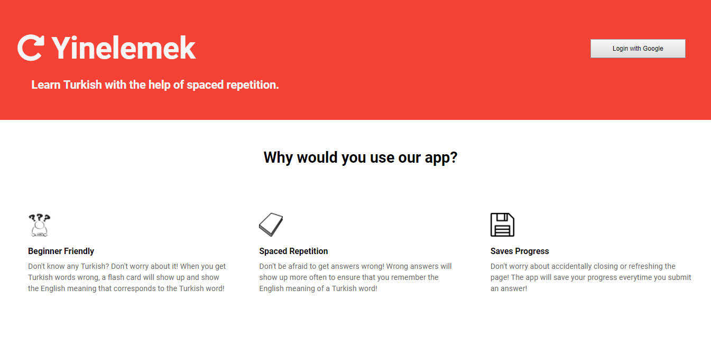

# Yinelemek
by Sonja Duric, Kyle Szeto <br/>

## Description
A Web App that uses a spaced repitition algorithm in order to help you learn Turkish. 

Our app is deployed at http://yinelemek.herokuapp.com/.

## Spaced Repitition Algorithm Explained
If you correctly answered the vocab, the importance value will be multiplied by 2 and move importance value spaces from the start point.

If you incorrectly answered the vocab, the importance value will be reset to 1 and it will show up after you finish answering the current word.

## Technology Used
**FrontEnd**: HTML, CSS, Javascript, React, Redux  </br>
**BackEnd**: NodeJs, Express, Passport, MongoDB, Mongoose </br>
**Deployment**: Mlab, Heroku, Travis </br>

## Things to Look Into in the Future
* How to use chai testing with Google Auth
* Making it visually appealing
* Reset Question/Score Feature

## Description Of API
### API Calls Done In Client
* **GET** http://yinelemek.herokuapp.com/api/vocab 
  * This allows you to get all the vocabs in the database 
  * This is used to store the vocab words in a linked list when a user initially created an account.
* **GET** http://yinelemek.herokuapp.com/api/auth/google  
  * This allows you to see which google account to login to by taking you to the google login page. 
* **GET** http://yinelemek.herokuapp.com/api/auth/google/callback
  * Once you signed in to your google account, this will lead you to our question page. 
* **GET** http://yinelemek.herokuapp.com/api/auth/logout 
  * This will remove the cookie of token and logs you out from our question page.
* **GET** https://tick-it-jk.herokuapp.com/api/users/me 
  * This allows you to get your current information from the database. 
  * This is used for session management purposes. 
* **PUT** https://tick-it-jk.herokuapp.com/api/users/checkAnswer 
  * This allows you to check if your answer is right or wrong.
  * It updates the database based on your input.

### Admin API Calls Done in Postman
If you don't have Postman, here's a link to download Postman: https://www.getpostman.com/

* **POST** http://yinelemek.herokuapp.com/api/vocab  
  * This allows you to post a vocab into the database 
  * This is used to add new vocabs into the database
* **PUT** http://yinelemek.herokuapp.com/api/vocab/:id
  * This allows you to update the vocab words
  * This is used to update vocab words you don't like or typed incorrectly.
* **DELETE** http://yinelemek.herokuapp.com/api/vocab/:id
  * This allows you to delete a vocab from the database 
  * This is used to delete any vocab words you don't like  
* **GET** https://tick-it-jk.herokuapp.com/api/users/ 
  * This allows user to get all the users from the database
  * This is used to allow you to see if your google user account is successfully added to the database.

## Getting started

First, fork the repo on Github to your own account

### Clone the repo

```sh
$ git clone https://github.com/YOUR_USERNAME_HERE/spaced-repetition-starter
```

```sh
$ cd spaced-repetition-starter
```

```sh
$ npm install
```

You can run it locally now with `npm run dev`, but the Google OAuth stuff won't work without your own credentials.

### Get Google OAuth Credentials

Visit https://console.developers.google.com

* Navigate to Library 
* Under 'Social APIs', Click 'Google+ API'
* Click 'Enable' at the top (if it isn't already)


* Navigate to Credentials
* It may require you to configure OAuth consent screen.
* Click 'Create credentials'
* Choose 'OAuth Client ID'
* Choose 'Web application'
* Add `http://localhost:8080` to Authorized JavaScript origins
* Add `http://localhost:8080/api/auth/google/callback` to Authorized redirect URIs
* Click 'Create'

You should get a Client ID and Secret.

Back in your project locally, create an `secret.js` file in the `/server` directory:

(Use the client ID and secret we just got from Google)

```js
module.exports = {
  CLIENT_ID: 'yourId123.apps.googleusercontent.com',
  CLIENT_SECRET: 'yoursecret',
  DATABASE_URL: 'mongodb://<dbuser>:<dbpassword>@ds035664.mlab.com:12345/example'
}
```

This file is ignored by git because it is in your `.gitignore`. Never commit or push 'secret.js', the client id and secret need to be kept safe like a password.

### Local Development
* Open a new terminal and change to directory you git clone this repo
* Make sure MongoDB is installed 
* Run `mongod` in the terminal => to run the mongodb server
* Open a new terminal and change to directory you git clone this repo
* Run `npm run dev` in terminal

## ScreenShots
#### LogIn Page/ Introductory Page
When you go to our website, you will be directed to our Introductory Page / Login Page </br>
 </br>

#### Question Page
When you are logged in from Google, you will be directed to our Question Page </br>
 </br>

#### Answer Correctly
If you answer the question correctly, it will look like the page below. </br>
 </br>

#### Answer Incorrectly
If you answer the question incorrectly, it will look like the page below. </br>
 </br>